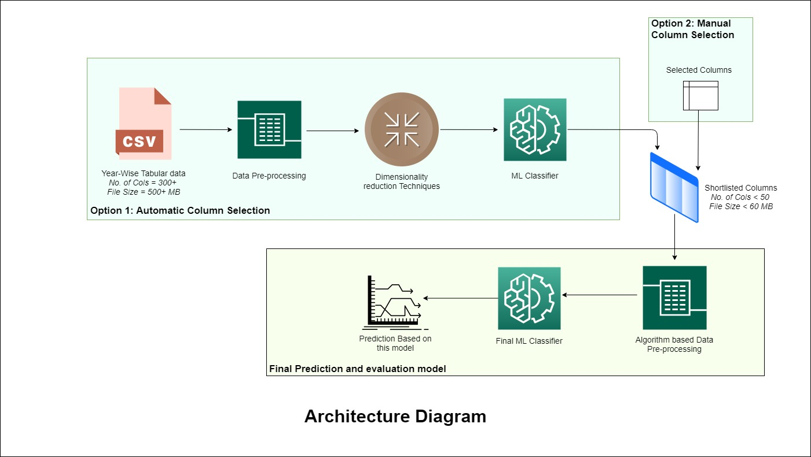

# Behavioral Risk Factors
This project identifies how an individual’s features, day-to-day activities, and existing medical conditions can impact their probability of contracting different diseases.With the help of the BRFSS dataset provided by the Centers for Disease Control and Prevention (CDC), the project explores the correlation between an individual’s attributes and their diseases. The project aims to develop data-driven insights to assist individuals in devising effective and accurate long-term strategies to mitigate the probability of them contracting a particular disease. On a large scale, these insights can help policymakers and communities develop effective policies for all individuals. The paper selects cardiovascular diseases, diabetes, and mental health disorders as the target variables and all other attributes as training data for this classification problem.

## Team Members
* Amit Sharma
* Pranav Karmalkar
* Swapnil Avinash Parihar

## How To run the Project

Full dataset for the project can be found at https://www.kaggle.com/cdc/behavioral-risk-factor-surveillance-system

Unfortunately CSV files for the input dataset are all in excess of 100MB. Since 100MB is the file size limit for Github the full dataset could not be added to this repository.

### Libraries Used and requirements to run the project
Developed in Python 3, the project utilizes Scikit learn libraries, including but not limited to Random forest, tree, GridSearchCV, and confusion_matrix. The project uses Matplotlib and Seaborn libraries for visualization. Pandas and Numpy libraries perform pre-processing and data manipulation duties.

### Architecture Diagram

The project is divided into three key parts and we have created folders for each of these parts:

#### For Mental Health Related Issues
MENT2015.csv is the curtailed output of the ColumnShortlistingXGBoost.ipynb file (limited to Top-40)and gives us a trimmed dataset from the overall dataset. Note that we could not include complete output due to size limtations of the GitHub repo. That said, this file can be used for as a small sample of the test data required for validating the AlgorithmTesting.ipynb file.

ColumnShortlistingXGBoost.ipynb takes input the data for one year at a time and then selects Top-40 features for that year. It then compares the all the Top-40 columns for the entire time span of the dataset.

FinalResults.csv is the final output of AlgorithmTesting.ipynb and provides the output for XGBoost and Random Forest algorithm and an ensemble of both the methods. 

AlgorithmTesting.ipynb compares different algorithms for the final prediction. It also has most of the visualizations related to mental health realted issues.

#### For Cardivascular Health Related Issues
CVD_manual_selected_features.ipynb is for initial cardiovascular health analysis and prediction. For it features were selected based on the exploratory data analysis and general understanding of cardiovascular diseases.

ColumnShortlisting_Cardiovascular.ipynb for selcting cardiovascular related features using XGBoost and gives us a trimmed dataset from the overall dataset. CARDIOVASCULAR2015.csv is the output file which can be used for as a small sample of the test data required for validating the Cardiovascular_final.ipynb file.

Cardiovascular_final.ipynb compares different algorithms for the final prediction. It also has most of the visualizations related to cardiovascular health realted issues.
